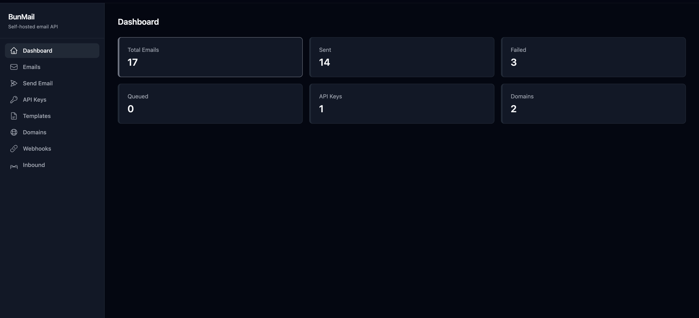
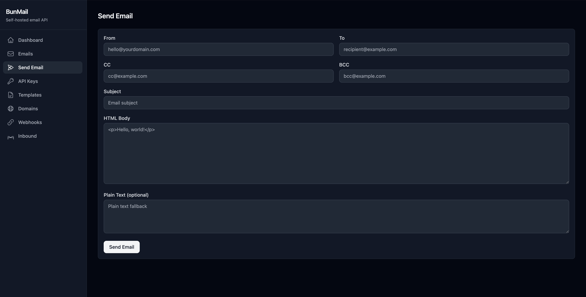
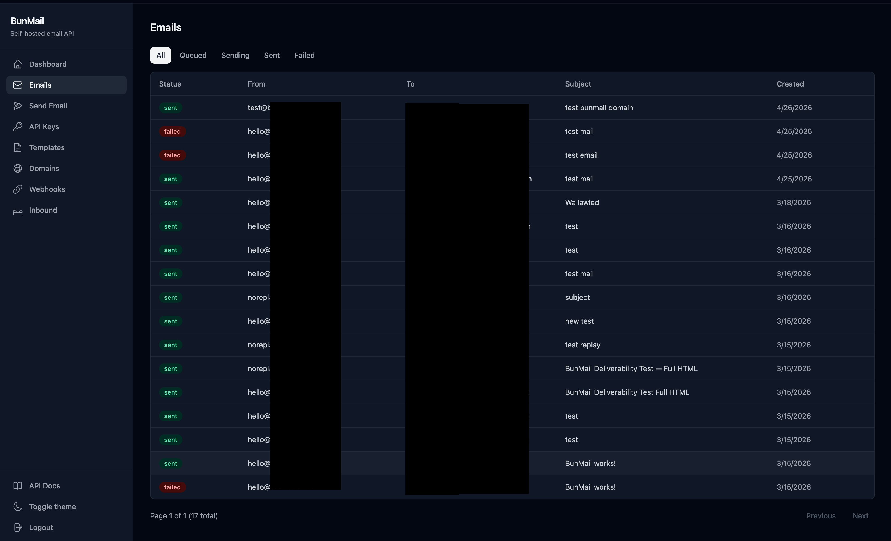
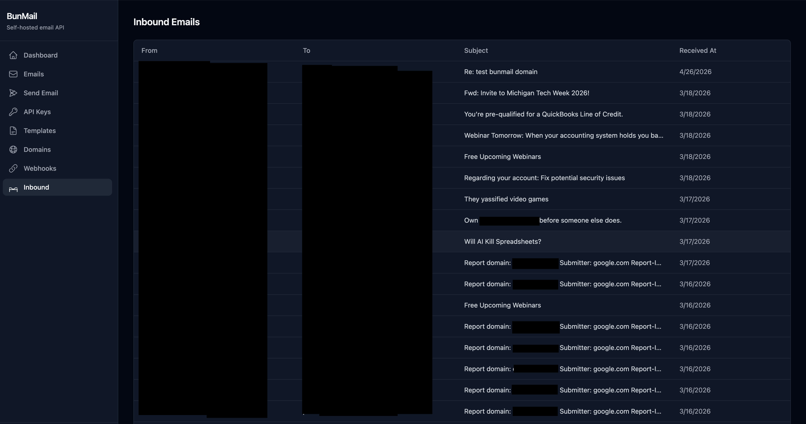
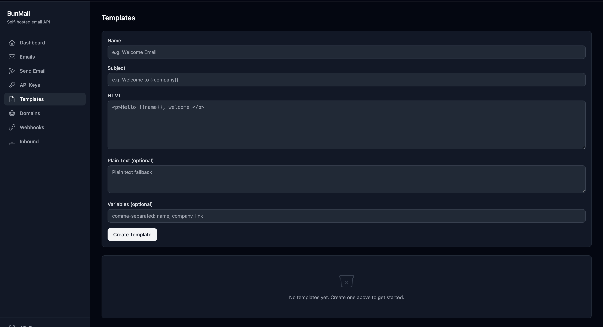
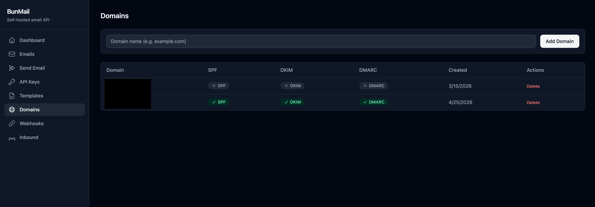
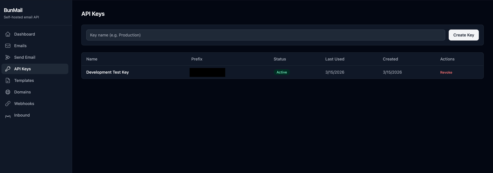

# BunMail

[](https://github.com/mohamedboukari/bunmail/actions/workflows/ci.yml)
[](https://github.com/mohamedboukari/bunmail/actions/workflows/codeql.yml)
[](LICENSE)
[](https://bun.sh)
[](https://elysiajs.com)
[](https://orm.drizzle.team)
[](https://www.postgresql.org)

> **Send transactional email from your own server.** No subscriptions. No per-email pricing. No vendor lock-in.

A self-hosted alternative to SendGrid, Resend, and Postmark — built in TypeScript on Bun + Elysia, with a REST API, web dashboard, DKIM signing, an email queue with retries, webhooks, templates, inbound SMTP, and Gmail-style trash. Ships in a single Docker container.

## Why BunMail?

| | BunMail | SendGrid / Resend | Postal | Mailcow |
|---|---|---|---|---|
| **Self-hosted** | ✅ | ❌ | ✅ | ✅ |
| **Free** | ✅ MIT | $20/mo+ | ✅ MIT | ✅ |
| **API-first** | ✅ | ✅ | ✅ | ❌ (mail hosting) |
| **One container** | ✅ | n/a | ❌ (multiple services) | ❌ (heavy stack) |
| **Modern stack** | Bun + Elysia + Drizzle | n/a | Ruby + RabbitMQ | PHP + many services |
| **Web dashboard** | ✅ | ✅ | ✅ | ✅ |
| **Templates** | ✅ | ✅ | ❌ | ❌ |
| **Inbound SMTP** | ✅ | $$ | ✅ | ✅ |

BunMail targets developers who want a **programmatic transactional email API** and nothing else — Postal is heavier, Mailcow targets full mail-server hosting with end-user webmail, and the SaaS options charge per email.

## Quick Start (60 seconds)

```bash
git clone https://github.com/mohamedboukari/bunmail.git && cd bunmail
cp .env.example .env
echo "POSTGRES_PASSWORD=$(openssl rand -hex 16)" >> .env
docker compose up -d
```

Then seed your first API key and send a test email:

```bash
docker compose exec app bun run src/db/seed.ts
# copy the bm_live_... key it prints

curl -X POST http://localhost:3000/api/v1/emails/send \
  -H "Authorization: Bearer bm_live_YOUR_KEY" \
  -H "Content-Type: application/json" \
  -d '{
    "from": "hello@yourdomain.com",
    "to": "user@example.com",
    "subject": "Hello from BunMail",
    "html": "<p>It works.</p>"
  }'
```

Open the dashboard at <http://localhost:3000/dashboard> (set `DASHBOARD_PASSWORD` in `.env` to enable).

> Local dev without Docker? See [docs/self-hosting.md](docs/self-hosting.md).

## Will my mail land in inbox?

**Honest answer: it depends on your sending setup, not on BunMail.** Self-hosted transactional email is a reputation problem, not a code problem.

- ✅ **You'll land in inbox** if you send from a domain with a clean reputation, your server's IP isn't on a blacklist, and you've published correct SPF / DKIM / DMARC records (BunMail handles SPF/DKIM/DMARC for you — see [docs/self-hosting.md](docs/self-hosting.md)).
- ⚠️ **You'll likely land in spam** if you send from a brand-new `.xyz`/`.top`-style domain on a fresh budget VPS IP. That's not a BunMail bug — Gmail and Outlook penalise both factors heavily for any sender.
- 🛠️ **Workarounds:** warm up your domain over 2–3 weeks (low volume, real recipients), or plug in a reputable SMTP relay (Postmark, SES, Resend) as the actual sender while keeping BunMail's queue, dashboard, and templates. *Relay mode is on the [roadmap](https://github.com/mohamedboukari/bunmail/issues).*

Run [mail-tester.com](https://www.mail-tester.com) to get a deliverability score for your specific setup before deploying.

## Screenshots



<table>
  <tr>
    <td><a href="public/Send-Email.png"></a></td>
    <td><a href="public/Emails.png"></a></td>
  </tr>
  <tr>
    <td><a href="public/Inbound.png"></a></td>
    <td><a href="public/Templates.png"></a></td>
  </tr>
  <tr>
    <td><a href="public/Domains.png"></a></td>
    <td><a href="public/API-Keys.png"></a></td>
  </tr>
</table>

## Features

- **Direct SMTP delivery** — sends straight to recipient MX servers, no relay needed
- **DKIM signing** — auto-generates 2048-bit RSA keys per domain
- **SPF / DKIM / DMARC verification** — DNS checks built into the dashboard
- **Email queue** — Postgres-backed with 3 retries, crash recovery, and exactly-once delivery semantics
- **Templates** — Mustache-style `{{variable}}` substitution
- **Webhooks** — HMAC-signed events: `email.sent`, `email.failed`, `email.received`
- **Inbound SMTP** — receive and store incoming mail with DNSBL, recipient validation, and per-IP rate limiting
- **API key auth** — SHA-256 hashed Bearer tokens with sliding-window rate limiting
- **Trash + auto-purge** — Gmail-style soft delete on outbound and inbound, restorable until purged after `TRASH_RETENTION_DAYS` (default 7)
- **Web dashboard** — server-rendered (Elysia JSX), bulk operations, real-time stats (24h sent, success rate, queue depth)
- **OpenAPI 3.0** — interactive docs at `/api/docs`
- **Type-safe** — strict TypeScript, Drizzle ORM, no `any`

## API Endpoints

All endpoints (except `/health`) require `Authorization: Bearer <api-key>`. Full reference: [docs/api.md](docs/api.md).

### Emails

| Method | Path | Description |
|--------|------|-------------|
| POST | `/api/v1/emails/send` | Queue an email (direct or template) |
| GET | `/api/v1/emails` | List emails (excludes trash) |
| GET | `/api/v1/emails/trash` | List trashed emails |
| GET | `/api/v1/emails/:id` | Get email by ID |
| DELETE | `/api/v1/emails/:id` | Move to trash |
| POST | `/api/v1/emails/bulk-delete` | Bulk move to trash |
| POST | `/api/v1/emails/:id/restore` | Restore from trash |
| DELETE | `/api/v1/emails/:id/permanent` | Permanently delete a trashed email |
| POST | `/api/v1/emails/trash/empty` | Empty trash |

### Inbound

| Method | Path | Description |
|--------|------|-------------|
| GET | `/api/v1/inbound` | List received emails |
| GET | `/api/v1/inbound/trash` | List trashed inbound |
| GET | `/api/v1/inbound/:id` | Get inbound email by ID |
| DELETE | `/api/v1/inbound/:id` | Move to trash |
| POST | `/api/v1/inbound/bulk-delete` | Bulk move to trash |
| POST | `/api/v1/inbound/:id/restore` | Restore from trash |
| DELETE | `/api/v1/inbound/:id/permanent` | Permanently delete a trashed inbound |
| POST | `/api/v1/inbound/trash/empty` | Empty inbound trash |

### Domains, Templates, API Keys, Webhooks

See [docs/api.md](docs/api.md) for full coverage of `/api/v1/domains`, `/api/v1/templates`, `/api/v1/api-keys`, `/api/v1/webhooks`.

## Send with a Template

```bash
# Create a template
curl -X POST http://localhost:3000/api/v1/templates \
  -H "Authorization: Bearer $BM_KEY" -H "Content-Type: application/json" \
  -d '{
    "name": "Welcome",
    "subject": "Welcome, {{name}}!",
    "html": "<h1>Hi {{name}}</h1><p>Welcome to {{company}}.</p>",
    "variables": ["name", "company"]
  }'

# Send using it
curl -X POST http://localhost:3000/api/v1/emails/send \
  -H "Authorization: Bearer $BM_KEY" -H "Content-Type: application/json" \
  -d '{
    "from": "hello@yourdomain.com",
    "to": "user@example.com",
    "templateId": "tpl_YOUR_TEMPLATE_ID",
    "variables": { "name": "Alice", "company": "Acme Inc" }
  }'
```

## Tech Stack

| Layer | Technology |
|-------|-----------|
| Runtime | [Bun](https://bun.sh) |
| Framework | [Elysia](https://elysiajs.com) |
| ORM | [Drizzle ORM](https://orm.drizzle.team) (`drizzle-orm/bun-sql`) |
| Database | PostgreSQL 16+ |
| SMTP outbound | Nodemailer (direct mode + DKIM) |
| SMTP inbound | smtp-server + mailparser |
| Dashboard | Elysia JSX (`@elysiajs/html` + `@kitajs/html`) |
| Deployment | Docker + Docker Compose |

## Architecture

```
HTTP (REST API + dashboard)  ─────► Elysia plugins (modules/)
                                          │
                                          ▼
                                    Services layer
                                          │
                            ┌─────────────┼─────────────┐
                            ▼             ▼             ▼
                       PostgreSQL    Email queue   Webhook dispatch
                                       (poll)        (HMAC-signed)
                                          │
                                          ▼
                              Nodemailer + DKIM signing
                                          │
                                          ▼
                              Recipient MX servers (port 25)
```

Inbound mail arrives via the built-in SMTP server (port 25/2525), gets parsed by `mailparser`, and is stored in `inbound_emails`. Webhooks fire `email.received` on inbound and `email.sent` / `email.failed` on outbound. See [ARCHITECTURE.md](ARCHITECTURE.md) for full diagrams.

## Development

```bash
bun install
bun run dev            # start dev server (--watch)
bun test               # run all tests
bun test test/unit     # unit tests only
bun test test/e2e      # integration tests only
bunx tsc --noEmit      # type check
bun run lint           # eslint
docker compose up -d   # full stack with Postgres
```

See [docs/](docs/) for module-level documentation:

- [docs/api.md](docs/api.md) — Full API reference
- [docs/dashboard.md](docs/dashboard.md) — Dashboard routes and structure
- [docs/emails.md](docs/emails.md) — Outbound module
- [docs/inbound.md](docs/inbound.md) — Inbound module
- [docs/self-hosting.md](docs/self-hosting.md) — Production deployment with DNS records

## Deliverability Setup

For inbox placement on Gmail / Outlook / Yahoo, you need:

1. **A clean sender domain** — older, no spam history.
2. **A clean IP** — check at [mxtoolbox.com/blacklists](https://mxtoolbox.com/blacklists.aspx).
3. **PTR (reverse DNS)** matching `MAIL_HOSTNAME` in `.env`.
4. **SPF, DKIM, DMARC records** — BunMail's dashboard tells you exactly what to publish per domain.
5. **Patience** — fresh domain + IP combos take 2–3 weeks of low-volume sending to build reputation.

See [docs/self-hosting.md](docs/self-hosting.md#dns-records) for the exact DNS record values.

## Roadmap

Active issues: [github.com/mohamedboukari/bunmail/issues](https://github.com/mohamedboukari/bunmail/issues)

Near-term highlights:

- Bounce parsing + suppression list (deliverability hardening)
- Optional SMTP relay mode (use Resend / SES / Postmark as the underlying sender)
- DSN handling and `email.bounced` webhook event
- DMARC aggregate report ingestion
- Webhook delivery persistence + replay
- DKIM private key encryption at rest

## Contributing

Issues, PRs, and discussions welcome. See [CONTRIBUTING.md](CONTRIBUTING.md) and the [good first issue](https://github.com/mohamedboukari/bunmail/issues?q=is%3Aissue+is%3Aopen+label%3A%22good+first+issue%22) label for ways to start.

## License

[MIT](LICENSE)
